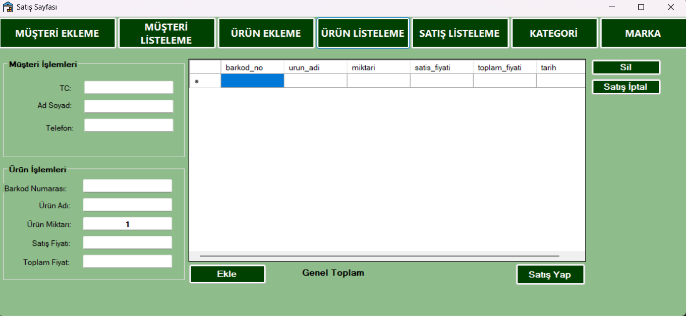

# 🛒 Stok Takip Otomasyonu (C# WinForms)

Bu proje, küçük ve orta ölçekli işletmelerin envanter yönetimini dijitalleştirmek amacıyla geliştirilmiş bir masaüstü uygulamasıdır. Ürünlerin sisteme kaydedilmesi, mevcut stok miktarlarının takibi ve verilerin kalıcı olarak saklanması süreçlerini yönetir.

## 🚀 Öne Çıkan Özellikler
- **Ürün Yönetimi:** Ürün adı, stok kodu ve miktar bilgilerini sisteme tanımlama.
- **Dinamik Liste:** Kaydedilen ürünlerin anlık olarak arayüzde sergilenmesi.
- **Veri Kalıcılığı:** Girilen tüm bilgiler `stok.txt` dosyasında saklanır; uygulama kapatılsa dahi veriler korunur.
- **Hızlı Güncelleme:** Stok giriş-çıkış süreçlerini yönetmek için optimize edilmiş kullanıcı arayüzü.

  

## 🛠 Teknik Mimari ve Teknolojiler
- **Dil:** C# (C-Sharp)
- **Framework:** .NET Desktop Development (Windows Forms)
- **Veri Saklama:** Dosya Giriş/Çıkış (File I/O) işlemleriyle `.txt` tabanlı basit bir veri tabanı yönetimi.
- **Mimari:** Event-driven (Olay tabanlı) programlama ve temiz bileşen yönetimi.

## 📂 Proje Yapısı
- `Form1.cs`: Kullanıcı etkileşimlerinin ve görsel arayüz mantığının bulunduğu ana dosya.
- `bin/Debug/`: Uygulamanın derlenmiş hali ve verilerin tutulduğu `stok.txt` dosyasının konumu.

## ⚙️ Kurulum ve Çalıştırma
1. Projeyi bilgisayarınıza indirin veya klonlayın.
2. Visual Studio ile `.sln` dosyasını açın.
3. `F5` tuşuna basarak projeyi derleyin ve çalıştırın.
